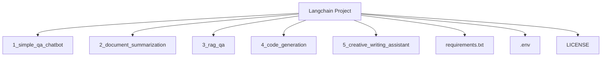

# LangChain and Ollama Use Cases

This repository contains five practical use cases demonstrating how to use LangChain with a local Ollama instance. Each use case is self-contained in its own directory.

## Project Structure



## Use Cases

1.  **Simple Q&A Chatbot:** A basic chatbot that answers questions.
2.  **Document Summarization:** A tool to summarize long texts.
3.  **RAG (Retrieval-Augmented Generation):** An advanced Q&A system that answers questions based on a knowledge base.
4.  **Code Generation:** A tool to generate code from natural language descriptions.
5.  **Creative Writing Assistant:** A helper for creative writing tasks.

## Getting Started

1.  **Install Ollama:** Make sure you have a local Ollama instance running. You can download it from [ollama.ai](https://ollama.ai/).

2.  **Set up the Environment:**
    *   Clone this repository.
    *   Create a `.env` file in the root of the project and add the following line, replacing `llama3` with the name of the model you are using:
        ```
        OLLAMA_MODEL=llama3
        ```
    *   Install the required Python packages:
        ```bash
        pip install -r requirements.txt
        ```

3.  **Run a Use Case:**
    *   Navigate to the directory of the use case you want to run (e.g., `cd 1_simple_qa_chatbot`).
    *   Run the `main.py` script:
        ```bash
        python main.py
        ```

## License

This project is licensed under the Apache License 2.0. See the [LICENSE](LICENSE) file for details.
